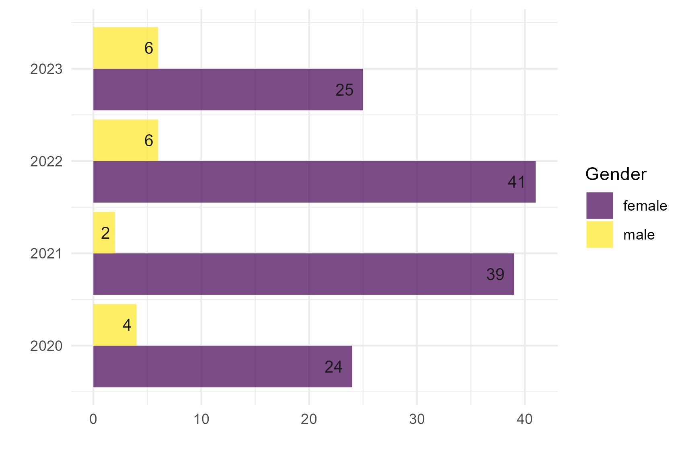
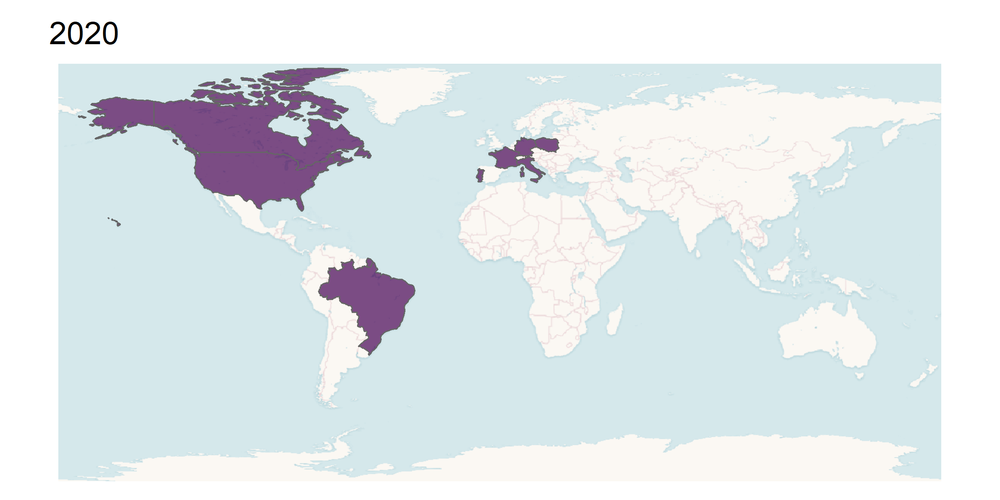

```{r setup, include=FALSE}
knitr::opts_chunk$set(echo = FALSE)
```

# Leituras anuais

Repositório para armazenar dados das leituras anuais. Desde 2020.

## Número de livros por ano, divididos por gênero

```{r geral, echo=FALSE}

```

## Origem de autoras/es por ano 


